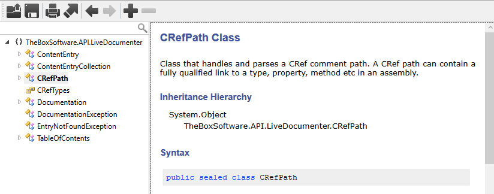
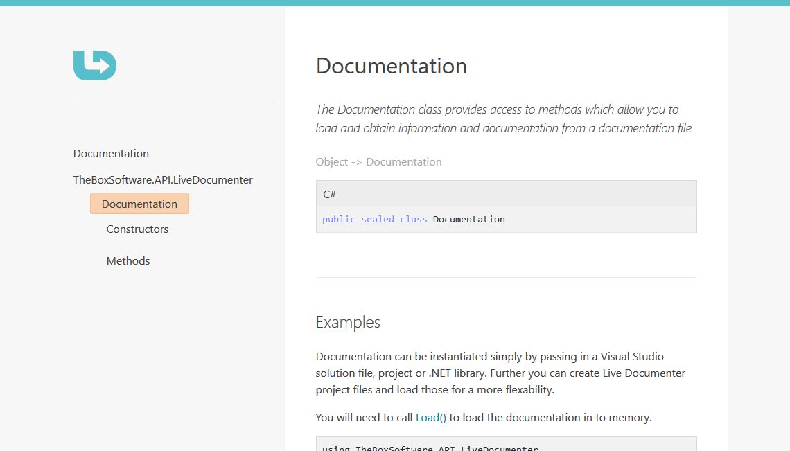
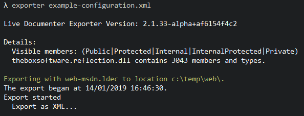

# Live Documenter 

__Don't let comments hide in your source code! Read it, search it and publish it with Live Documenter. Documentation for .NET made easy.__

Live Documenter is a suite of applications and libraries that enable the live viewing and automatic generation of documentation from .NET code and xml comment files. Learn what Live Documenter is from our [homepage](https://livedocumenter.barryjones.me.uk/docs) and [download](https://livedocumenter.barryjones.me.uk/download) the latest version.

__View documentation live and up to date!__

__Create beautiful static documentation.__

Or use the API library to integrate in to your own projects.

***

## Introduction

The Live Documenter is a desktop application, console utility and API library designed to make your .NET code and comments more readable and more available. Lets free them from the confines of the xml squirrelled away in your source code and put them to good use!

Get started by downloading the [latest version](https://livedocumenter.barryjones.me.uk/download) and reading the quick [start guide](https://livedocumenter.barryjones.me.uk/doc).

### Desktop Application
The desktop application allows visual studio projects, solutions or libraries to be opened and documentation generated for them from the XML comment files live. If changes are made to the codebase these are reflected in the application when the project is re-built.

It also provides a nice interface for exporting documentation, reading and printing.

### Console Application
The exporter application is useful for integrating documentation generation in to existing processes; such as your build scripts or creating ad-hoc documentation.

### API Library
A DLL that can be referenced by projects to automatically generate documentation at runtime. Details of the API and how to use it can be found in the [documentation][1].

## Installation
This will only work on Windows at the moment, work is ongoing to transfer to netstandard 
and to make everything except the desktop application cross platform on .NET Core.

The installers are provided in the release pages for the [latest version](https://github.com/barry-jones/live-documenter/releases) MSI files are provided separately. 
To install, download the required MSI files from the release page and run the installer.

## Build Latest

Requirements
-  .NET Core SDK 2.2
-  .NET Framework 4.7.1

The latest code has been worked on in Visual Studio 2017 and several of the projects have been transferred to netstandard libraries and use the latest csproj file format.

__Please let me know if there are any issues building from source so I can resolve them.__

## Helping the project
All help is appreciated. There is an [associated documentation](https://github.com/barry-jones/livedocumenter-site) site that can always be improved.

If you would like to get involved in the project, please take a look at the current issues. Make a note of your interest, get the latest version and create a pull request when you are ready to merge the changes.

Also simply providing feedback via GitHub issues helps to make sure the project is being made more stable and is being constantly enhanced.

[1]: https://livedocumenter.barryjones.me.uk/docs/api/index.html
