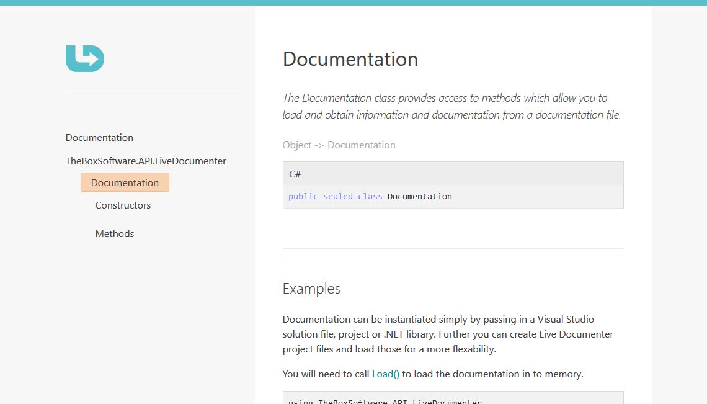

# Live Documenter 2.1 Update - Jan 2019

The 2.1 update refreshes the application with netstandard libraries bringing it up to date. Adds a new web refresh exporter, and improves performance.

## Changes in 2.1

* General perforance improvements to exporting and publishing
* Added support for new net core csproj project file format
* Removed Saxon HE and replaced with System.Xml CompiledTransform to support netstandard2.0 and improve portability.
* Updated libraries to netstandard2.0, updated console application to use netcoreapp2.2, updated pe viewer and live documenter to NET 4.7.1
* Created new `web-refresh.ldec` exporter with up to date clean web export
* Improved standard output details in exporter console application
* Added ability to export without configuration files in the console application
* Fixed help link in live documenter for the missing Xml Comment File message
* Fixed issue with no return type information for methods
* Fixed issue with set keyword missing from c# property syntax
* Fixed issue with c# constructor syntax formatting
* Fixed issue where types are not being documented when they have no namespace
* Fixed issue with ByRef syntax in VB not being shown
* Resolved issues with c# delegate syntax formatting
* Fixed issues with interface and base class display formatting for c# syntax

## Review of changes

__New web-refresh web export__

HTML 5, responsive layout with a clean fresh look.



__Improved console application__

```shell
The exporter takes the following arguments
   exporter <filename> mmodifiers

   [e.g.] exporter theboxsoftware.reflection.dll -to c:\temp\web -filters "public|protected"

   <filename>  The path to the configuration file, library, project or solution.
   modifiers:
     -h        show help information
     -v        show verbose export details
     -to       the directory to export to
     -format   the ldec file format to export content. Defaults to web-msdn.ldec
     -filters  the visibilty filters (public|protected etc) defaults to public
               "all" can be provided as a shortcut to:-
                  "public|protected|internal|interalprotected|private"


`-to`, `-format` and `-filters` are only used when the file provided is not a
configuration xml file.
```